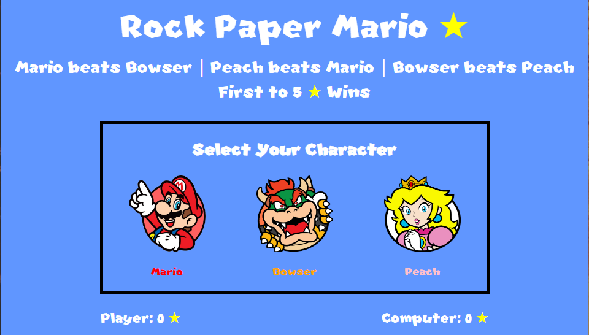
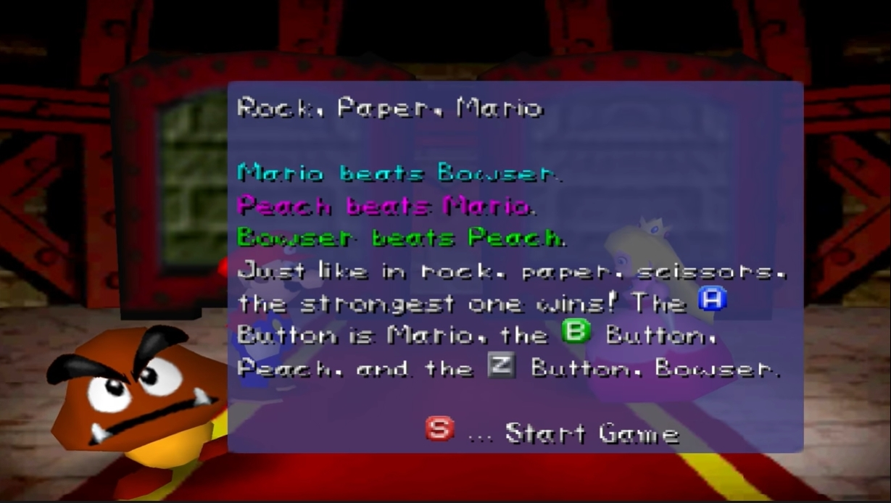

# Rock Paper Scissors JS (Rock Paper Mario)
## Link: https://anthonylombardo321.github.io/Rock-Paper-Scissors-JS/

    

This project (from the Odin Project) taught me how to use the DOM to get elements and apply event listeners to create a game of Rock Paper Scissors with a functional UI. This version of Rock Paper Scissors is derived from the mini-game from Mario Party 2 (Also, called Rock Paper Mario). I hope you enjoy it.

### Rules:

    

